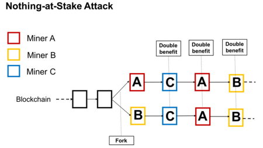

# Blockchain Common Attack Techniques
Table of Contents
- [Protocol Layer](#protocol-layer)
  - [Consensus](#consensus)
    - [Long Range Attack](#long-range-attack)
    - [Race Attack](#race-attack)
    - [Liveness Denial](#liveness-denial)
    - [Finney Attack](#finney-attack)
    - [Vector76 Attack](#vector76-attack)
    - [Alternative Historical Attack](#alternative-historical-attack)
    - [51% Attack](#51-attack)
    - [Stake Grinding Attack](#stake-grinding-attack)
    - [Coin Age Accumulation Attack](#coin-age-accumulation-attack)
    - [Nothing-at-Stake Attack](#nothing-at-stake-attack)
    - [Block Double Production](#block-double-production)
- [Network Layer](#network-layer)
  - [P2P](#p2p)
    - [Sybil Attack](#sybil-attack)
    - [Eclipse Attack](#eclipse-attack)
    - [Eavesdropping Attack](#eavesdropping-attack)
    - [Denial of Service Attack](#denial-of-service-attack)
    - [BGP Hijack Attack](#bgp-hijack-attack)
    - [Alien Attack](#alien-attack)
    - [Timejacking](#timejacking)
- [Data Layer](#data-layer)
  - [Encryption](#encryption)
    - [Cryptographic Attacks](#cryptographic-attacks)
    - [Private Key Prediction](#private-key-prediction)
    - [Length Extension Attack](#length-extension-attack)
    - [Hash collision attack](#hash-collision-attack)
  - [Transaction](#transaction)
    - [Transaction Replay Attack](#transaction-replay-attack)
    - [Transaction Malleability Attack](#transaction-malleability-attack)
    - [Time-Locked Transaction Attack](#time-locked-transaction-attack)
    - [False Top-Up Attack](#false-top-up-attack)
    - [Rug Pull Attack](#rug-pull-attack)
- [Infrastructure Layer](#infrastructure-layer)
  - [RPC](#rpc)
    - [Information Leakage](#information-leakage)
    - [Denial of Service Attack](#denial-of-service-attack-1)
    - [Cross-Domain Phishing Attack](#cross-domain-phishing-attack)
    - [Man-in-the-middle Attack](#man-in-the-middle-attack)
    - [Injection Attack](#injection-attack)
  - [Mining Pools](#mining-pools)
    - [Selfish Mining](#selfish-mining)
    - [Bribery Attack](#bribery-attack)
    - [Block Withholding Attack](#block-withholding-attack)
    - [Pool Hopping Attack](#pool-hopping-attack)
    - [Block Discarding Attack](#block-discarding-attack)
    - [Fork After Withholding Attack](#fork-after-withholding-attack)
    - [Uncle-Block Attack](#uncle-block-attack)
      
# Protocol Layer
## Consensus
### Long Range Attack
- Severity: High
- Description:  
A Long-Range attack is an attack scenario where the adversary goes back to the genesis block and forks the blockchain. The new branch is populated with a partially, or even completely, different history than the main chain. The attack succeeds when the branch that is crafted by the adversary becomes longer than the main chain, hence it overtakes it. Long-Range attacks fall into three different categories, namely Simple, Posterior Corruption, and Stake bleeding. 
In some sense, Long-Range attacks in PoS protocols are related to selfish mining attacks of PoW protocols as the attacker in both cases is adding blocks that are kept secret. Obviously, selfish mining attacks cannot go back to the genesis block of PoW protocols as the computational effort needed is prohibiting, therefore, the impact that they may have is limited. Nevertheless, both attacks fork the main chain and try to append forged blocks where the attacker potentially includes different transactions.
- Recommendation:  
  Assigning a list of bootstrap nodes, implementing checkpoints, and assigning a range of blocks to always be considered true. Any of these recommendations can prevent this attack from succeeding. 
- References:  
  * [A Survey on Long Range Attacks for
Proof of Stake Protocols](https://ieeexplore.ieee.org/stamp/stamp.jsp?arnumber=8653269)  
  * [Rewriting History: A Brief Introduction to Long Range Attacks](https://blog.positive.com/rewriting-history-a-brief-introduction-to-long-range-attacks-54e473acdba9)
### Race Attack
- Severity: High
- Description:  
Is a type of “Unconfirmed Transaction” Attack. A race attack is executed when an attacker creates two conflicting transactions. The first transaction is sent to the victim, who accepts the payment (and sends a product, for instance) without waiting for confirmation of the transaction. At the same time, a conflicting transaction returning the same amount of cryptocurrency to the attacker is broadcast to the network, eventually making the first transaction invalid.
- Recommendation:  
  Wait at least 6 or more confirmations on the network to consider a transaction safe and irreversible.
### Liveness Denial
- Severity: High
- Consensus affected: PoS / DPoS
- Description:  
  Liveness Denial is a form of Denial of Service attack in PoS protocols. In this attack, some or all of the validators decide to take action and purposefully block transactions by stopping publishing blocks. By avoiding to perform their validator duties, the blockchain will come to a halt as new blocks would not be able to be validated and published in the blockchain. A liveness requirement which slowly drains the stake of inactive validators will ensure that even if the majority of validators are either offline or performing a liveness denial attack, they would not compromise the network. 
- Recommendation:  
  In cases where liveness cannot be assessed, the community will be able to decide (off-chain communication) to fork the blockchain and remove the inactive validators. In all cases, validators who conduct this type of attack jeopardize their position in the network as validators and their stake if a slashing condition exists
### Finney Attack
- Severity: High
- Consensus affected: PoW
- Description:  
The Finney attack is named after Hal Finney, who suggested it [in this comment](https://bitcointalk.org/index.php?topic=3441.msg48384#msg48384). (Hal is the first recipient of a Bitcoin transaction, and the first person to comment on the release of the Bitcoin source code.)
  The Finney Attack is a type of double-spending attack that proceeds as follows:
<ol>
  <li>The attacker mines blocks normally; in the block he is trying to find, he includes a transaction that sends some of his coins back to himself (from his main wallet to another that he also controls) without broadcasting this transaction.</li>
  <li>When he finds a block, he does not broadcast it; instead, he sends the same coins to a merchant for some goods or services.</li>
  <li>Once the merchant accepts the payment and irreversibly provides the service, the attacker broadcasts his block; the transaction that sends the coins to himself, included in this block, will override the unconfirmed payment to the merchant.</li>
</ol>

- Recommendation:  
  Wait at least 6 or more confirmations on the network to consider a transaction safe and irreversible.
- Reference:  
[What is a Finney Hack or Finney Attack?](https://academy.bit2me.com/en/que-es-un-hackeo-finney-ataque-finney/#:~:text=It%20is%20the%20first%20known,any%20cryptocurrency%20derived%20from%20it.)  
### Vector76 Attack
- Severity: High
- Consensus affected: PoW
- Description:  
  Also known as a **one-confirmation attack**. Is a combination of Race attack and Finney attack. 
  In this case, a malicious miner creates two nodes, one is connected only to the exchange node, and the other is connected to well-connected peers in the blockchain network. With this, the miner creates two transactions, one with a high value and one with a low value. Then, the attacker premines and withholds a block with the high-value transaction from an exchange service. After a block announcement, the attacker quickly sends the premined block directly to the exchange service. It along with some miners will consider the premined block as the main chain and confirm this transaction. Thus, this attack exploits the fact that one part of the network sees the transaction the attacker has included into a block while the other part of the network doesn’t see this transaction.
  After the exchange service confirms the high-value transaction, the attacker sends the low-value transaction to the main network, which finally rejects the high-value transaction. As a result, the attacker’s account is credited the amount of the high-value transaction. Though there’s a high chance for success with this type of attack, it’s not common because it requires a hosted e-wallet that accepts the payment after one confirmation and a node with an incoming transaction.
- Recommendation:  
  Wait at least 6 or more confirmations on the network to consider a transaction safe and irreversible.
### Alternative Historical Attack
- Severity: High
- Consensus affected: PoW / PoS / DPoS
- Description:  
  Also known as **blockchain reorganization attack**.
  Chain reorgs more often occur naturally as a result of network latency, and “re-organizing” the blockchain is a built-in feature of Bitcoin and similar protocols, designed to keep everyone on the right track. When honest nodes restore order to the blockchain, reorgs pass unnoticed by the public. The routine and naturally occurring reorgs usually nullify (or “orphan”) just one or two invalid blocks. 
  In simple words, a “reorg attack” is a deliberate attempt to rewrite history by creating an alternate legitimate chain of transactions (i.e. the chain with the most proof-of-work). It’s usually done by mining an alternate chain in secret, then broadcasting the results once that chain is longer than the legitimate one. If the motive is profit, the alternate chain would contain double-spend attempts of some kind. Even if an attack of this kind is detected and rectified by honest miners, it can cause havoc and disruption.
- Recommendation:  
  In a blog post, Vitalik Buterin introduces a concept he calls “weak subjectivity” where
nodes weigh blocks that were seen earlier higher than those seen later when selecting the
most work chain in the case of a potential reorg. The intention is to punish miners who
delay submitting their blocks to the network by requiring them to produce a much higher
total work chain than under traditional Nakamoto consensus before nodes will reorg.
- References:  
  * [Chain Reorganisation](https://learnmeabitcoin.com/technical/chain-reorganisation)  
  * [What is chain reorganization in blockchain technology?](https://cointelegraph.com/explained/what-is-chain-reorganization-in-blockchain-technology)  
  * [Blockchain attacks and reorgs: Experiences from the past](https://coingeek.com/blockchain-attacks-and-reorgs-experiences-from-the-past/)
  * [An Empirical Analysis of Chain Reorganizations and Double-Spend Attacks on Proof-of-Work Cryptocurrencies](https://allquantor.at/blockchainbib/pdf/lovejoy2020empirical.pdf)
### 51% Attack
- Severity: High
- Consensus affected: PoW / PoS / DPoS
- Description:  
  Also known as **majority attack**.
  In PoW systems, the entity which controls the majority of the hashing power at a specific timeframe can have complete control over the blockchain, for instance, they can fork the main chain and start mining on their branch. Slowly and steadily, the attackers will be able to outpace the main chain and have their branch take its place.  
  Since in PoW protocols block generation is probabilistic, there are many chances to have conflicting branches, which diminish as we move past the 51% barrier. Therefore, the adversary will have the main chain, but branch reversions will often happen at that point.  
  In PoS protocols this attack is still viable but with a slightly different impact. It is possible for one validator or a coordinated set of validators to own more than 34% (for BFT PoS) of that blockchain’s stake. In this case, a majority attack can impact the blockchain by performing finality reversion, where an already finalized block is being challenged by finalizing another competing block, causing Liveness Denial or Censorship.
- Recommendation:  
  Once a blockchain grows large enough, the likelihood of a single person or group obtaining enough computing power to overwhelm all the other participants rapidly drops to very low levels.
- References:  
  * [Understanding a 51% Attack on the Blockchain](https://www.section.io/engineering-education/understanding-the-51-attack-on-blockchain/#ways-to-prevent-a-51-attack) 
  * [What Is a 51% Attack?](https://academy.binance.com/en/articles/what-is-a-51-percent-attack)
### Stake Grinding Attack
- Severity: High
- Consensus affected: PoS / DPoS
- Description:  
  Also known as **precomputation attack**. 
  Is a class of attack that afffects PoS protocols where a validator performs some computation or takes some other step to try to bias the randomness in their own favor. For example: 
<ol>
<li>In Peercoin, a validator could "grind" through many combinations of parameters and find favorable parameters that would increase the probability of their coins generating a valid block.</li>
<li>In one now-defunct implementation, the randomness for block N+1 was dependent on the signature of block N. This allowed a validator to repeatedly produce new signatures until they found one that allowed them to get the next block, thereby seizing control of the system forever.</li>
<li>In NXT, the randomness for block N+1 is dependent on the validator that creates block N. This allows a validator to manipulate the randomness by simply skipping an opportunity to create a block. This carries an opportunity cost equal to the block reward, but sometimes the new random seed would give the validator an above-average number of blocks over the next few dozen blocks. See here and here for a more detailed analysis.</li>
</ol>

- Recommendation:  
  (1) and (2) are easy to solve; the general approach is to require validators to deposit their coins well in advance, and not to use information that can be easily manipulated as source data for the randomness. There are several main strategies for solving problems like (3). The first is to use schemes based on [secret sharing](https://en.wikipedia.org/wiki/Secret_sharing) or [deterministic threshold signatures](https://eprint.iacr.org/2002/081.pdf) and have validators collaboratively generate the random value. These schemes are robust against all manipulation unless a majority of validators collude (in some cases though, depending on the implementation, between 33-50% of validators can interfere in the operation, leading to the protocol having a 67% liveness assumption). 
  The second is to use cryptoeconomic schemes where validators commit to information (i.e. publish sha3(x)) well in advance, and then must publish x in the block; x is then added into the randomness pool.
- Reference:  
[Bribery and stake grinding attacks](https://web.stanford.edu/class/archive/ee/ee374/ee374.1206//downloads/l18_notes.pdf)  
### Coin Age Accumulation Attack
- Severity: High
- Consensus: PoS / DPoS
- Description:  
  In the early version of Peercoin protocol, the user’s stake would accumulate more weight the more time it was staked without having any time restrictions. Given enough time, an attacker would have accumulated enormous amounts of stake in the system which would allow them to take over the network. The coin age mechanism worked as an amplification technique to the stake of its validators. 
- Recommendation:  
  As a mitigation technique, the coin age mechanism was capped at a certain amount of time or was completely removed.
- Reference:  
[Robust Proof of Stake: A New Consensus Protocol for Sustainable Blockchain Systems](https://www.mdpi.com/2071-1050/12/7/2824/pdf) 
### Nothing-at-Stake Attack
- Severity: Medium
- Consensus affected: PoS / DPoS
- Description:  
   
  The “nothing-at-stake” problem refers to the fact that block creators on generic proof-of-stake protocols do not have anything at stake when the network forks. This is one of the primary criticisms of proof-of-stake consensus mechanisms. When a proof-of-work based network, like Bitcoin, forks, every active miner creating blocks on the network must *choose* which fork to mine on. A mining unit cannot create blocks on both forks at the same. The scarcity of the hash power is what forces (in theory) the fork to resolve. When a proof-of-stake protocol forks though, the scarce resource for block production is not hash power but token stake, and, in a fork, an equivalent amount of stake is created on the new network. This means a block creator can start creating blocks on both networks immediately and they do not have to choose (the computation cost of creating a block in a POS system is generally trivial because miners are not competing with each other based on computation). This makes it difficult, if not impossible, for a simple POS system to resolve forks; moreover, it can make double-spend attacks much cheaper in the case of fork resolution.
- Recommendation:  
  [Casper explanations](https://blog.ethereum.org/2015/08/01/introducing-casper-friendly-ghost/) outlined methods of defense. The original [Cosmos whitepaper](https://github.com/cosmos/cosmos/blob/master/WHITEPAPER.md) also discussed several defenses. Most solutions center on punishing block creators if it can be proven that they are creating blocks on another network.
- Reference:  
  * [Nothing-at-Stake Problem](https://smithandcrown.com/glossary/nothing-stake-problem/)
  * [Robust Proof of Stake: A New Consensus Protocol for Sustainable Blockchain Systems](https://www.mdpi.com/2071-1050/12/7/2824/pdf)
### Block Double Production
- Severity: High
- Consensus affected: PoW / PoS / DPoS
- Description:  
  Block Double Production is an attack on a blockchain network in which an attacker uses their computational power to mine or validate multiple valid blocks at the same time. This can lead to a fork in the blockchain, with two different versions of the same block being created. The attacker can then choose which version of the block to broadcast to the network, effectively allowing them to double-spend coins or reverse transactions. This could also be a precursor to a long-range attack or a short-range attack.
- Recommendation:  
  Preventing Block Double Production attack is done by implementing a mechanism that can detect this kind of attack and then responding to it in a way that will minimize the damage that it causes. For example, a blockchain network might have a mechanism in place to automatically switch to a different version of the blockchain if it detects that a fork has occurred.

# Network Layer
## P2P
### Sybil Attack
- Severity: High
- Description:  
   An attacker creates multiple fake identities, or "Sybils," in order to gain control over a significant portion of the network's resources or influence the outcome of consensus decisions. The attacker can then use this control to disrupt the network's operations or steal resources from legitimate users. 
   A Sybil attack can take the form of creating multiple fake nodes or "Sybil nodes" that the attacker controls. The attacker can then use these nodes to manipulate the network's consensus process, such as by controlling more than half of the network's computational power in a proof-of-work consensus mechanism or by controlling a large number of votes in a proof-of-stake mechanism.
- Recommendations:  
  * Sybil attack prevention is done by creating a mechanism that can reliably identify the true identities of network participants, and then using this information to limit the number of resources that any one participant can control. For example, a blockchain network might use a reputation-based system to assign each node a score based on its past behavior, and then use this score to limit the amount of computational power that each node can use. 
  * Using "proof of identity" can be used to prevent Sybil attacks, which requires users to prove their identity through a trusted third party or a government-issued ID. 
  * Another solution can be that each node monitors the behavior of other nodes and checks for the nodes which are forwarding the blocks of only one particular user. Such nodes are quickly identified, blacklisted and notified to other nodes, and thus the Sybil attack can be restricted. 
- Reference:  
[Preventing Sybil Attack in Blockchain using Distributed Behavior Monitoring of Miners](https://ieeexplore.ieee.org/document/8944507)  
### Eclipse Attack
- Severity: High
- Description:  
   An attacker isolates a specific node from the rest of the network by controlling the majority of the nodes that the targeted node is connected to. This allows the attacker to control the flow of information to and from the targeted node, allowing them to disrupt the network's operations or steal resources from the targeted node.
- Recommendations:  
  Nodes can be eclipsed if an attacker has access to sufficient IP addresses. The easiest way to avoid this is for a node to restrict inbound connections and be deliberate about any connections made with other nodes. 
  Other common approaches include:
  * **Random node selection:** By structuring a peer-to-peer network in a way in which each node connects to a randomized set of IP addresses each time it syncs with the network rather than adhering to a repeating, exploitable set of node criteria
  * **Deterministic node selection:** Taking the opposite approach from random node selection, deterministic node selection involves the insertion of specific node IP addresses into their corresponding predetermined fixed slots every time they connect with the network. By fixing the connections of the network’s nodes, an attacker will have a harder time maneuvering malicious nodes through the network and converging around a target, and the repeated insertion of attacker-controlled addresses will not necessarily contribute to the success of an eclipse attack attempt. 
  * **Increased node connections:** By increasing the required number of node-to-node connections, a network would be able to increase the likelihood that a node will connect to a legitimate user. However, there are node constraints and bandwidth constraints which limit the extent to which a network can increase the number of node connections without sacrificing performance, limiting the efficacy of this approach as a stand-alone solution to eclipse attacks.
  * **New node restrictions:** By making it more expensive or difficult to create new nodes within a network, the blockchain architect can set a higher bar for malicious actors to flood the network with attacker-controlled nodes. Oftentimes this approach involves limiting the number of nodes per IP address or device, although this defensive measure can be circumvented by an attacker deploying a botnet composed of devices which have their own unique IP addresses.
- Reference:  
[Eclipse Attacks: Explanations and Preventions](https://www.gemini.com/cryptopedia/eclipse-attacks-defense-bitcoin)  
### Eavesdropping Attack
- Severity: Low
- Description:  
The attacker passively listens to network communications to gain access to private information, such as node identification numbers, routing updates, or application-sensitive data. The attacker can use this private information to compromise nodes in the network, disrupt routing, or degrade application performance.
- Recommendation:  
  Encrypt communications using encryption protocols, such as TLS.
- Reference:  
[The RLPx Transport Protocol](https://github.com/ethereum/devp2p/blob/master/rlpx.md)  
### Denial of Service Attack
- Severity: Medium
- Description:  
    A Denial of Service (DoS) attack is a type of attack in which an attacker aims to disrupt the normal functioning of a network by overwhelming it with a large number of requests or traffic. In a blockchain network, a DoS attack can take various forms, such as: 
<ol>
  <li>Flooding the network with a high number of invalid transactions, making it difficult for legitimate transactions to be processed.</li>
  <li>Overloading the network with a high number of requests to the nodes, making them unable to keep up with the traffic, and causing them to crash.</li>
  <li>Attempting to isolate specific nodes from the rest of the network by overwhelming them with a large number of requests.</li>
  <li>Attempting to overload the consensus mechanism of the network, making it difficult for it to reach a decision.</li>
</ol>

- Recommendation:  
  Preventing a DoS attack on a blockchain network can be done by using techniques such as rate limiting, which limits the number of requests that a network will accept from a single source, or using a distributed architecture, which makes it more difficult for an attacker to overwhelm a specific node or set of nodes. Additionally, using a decentralized peer discovery mechanism, which allows nodes to find new peers without relying on a central authority, can decrease the chance of a DoS attack.
### BGP Hijack Attack
- Severity: Low
- Description:  
  A BGP (Border Gateway Protocol) hijack attack is a type of cyber-attack that targets the routing infrastructure of the internet. It occurs when an attacker redirects internet traffic meant for a specific network or IP address to a different network or IP address under the attacker's control. In a blockchain network, a BGP hijack attack can be used to disrupt the communication between nodes in the network, preventing them from reaching consensus and leading to a fork in the blockchain.
- Recommendations:  
  * Increase the number of nodes in different regions.
  * [SABRE: Protecting Bitcoin against Routing Attacks](https://arxiv.org/abs/1808.06254)
- References:  
  * [BGP Hijacking](https://en.wikipedia.org/wiki/BGP_hijacking)
  * [Hijacking Bitcoin: Routing Attacks on Cryptocurrencies](https://ieeexplore.ieee.org/document/7958588)  
  * [KlaySwap crypto users lose funds after BGP hijack]( https://medium.com/s2wblog/post-mortem-of-klayswap-incident-through-bgp-hijacking-898f26727d66)  
  * [Blockchain meets Internet Routing](https://btc-hijack.ethz.ch/)
### Alien Attack
- Severity: Low
- Description:  
  Alien attack, also known as address pool pollution, refers to an attack method that induces nodes of the same chain to invade and pollute each other. The main reason for the vulnerability is that the same chain system does not identify non-similar nodes in the communication protocol. 
Ethereum alien attack means that Ethereum's similar chain (specifically, the public chain using the Ethereum P2P discv4 node discovery protocol, including Ethereum and Ether Classic) cannot distinguish whether the nodes belong to the same one because they use a compatible handshake protocol. The chain causes the address pools to pollute each other, and the communication performance of the nodes decreases, eventually causing the node to block.
- Recommendation:  
  Add network identification to P2P connection protocol, such as ChainID in Ethereum, and Magic in Bitcoin.
- Reference: 
  [The public chain of conflict! Alien Attack Vulnerability from P2P Protocol](https://blocking.net/1999/the-public-chain-of-conflict-alien-attack-vulnerability-from-p2p-protocol/)
### Timejacking
- Severity: High
- Description:  
  Timejacking exploits a theoretical vulnerability in Bitcoin timestamp handling. During a timejacking attack, a hacker alters the network time counter of the node and forces the node to accept an alternative blockchain. This can be achieved when a malicious user adds multiple fake peers to the network with inaccurate timestamps.
- Recommendation:  
  A timejacking attack can be prevented by restricting acceptance time ranges or using the node’s system time.

# Data Layer

## Encryption
### Cryptographic Attacks
- Severity: High
- Description:  
  A cryptographic attack is a method for circumventing the security of a cryptographic system by finding a weakness in a code, cipher, cryptographic protocol or key management scheme. This process is also called "cryptanalysis". 
  Some common attack methods are: Analytic Attack / Implementation Attack / Statistical Attack / Brute Force / Frequency Analysis and the Ciphertext Only Attack / Known Plaintext / Chosen Ciphertext  / Chosen Plaintext / Meet in the Middle / Man in the Middle  / Birthday attack / Replay attack / Collision attack, among many others.
- Recommendation:  
  Depending on the attack, several measures could be used to prevent any cryptographic flaws, for example, avoiding the usage of unknown encryption libraries, using SSL/TLS in communication channels, etc.
- Reference:  
[Cryptographic attacks](https://en.wikipedia.org/wiki/Category:Cryptographic_attacks#:~:text=A%20cryptographic%20attack%20is%20a,is%20also%20called%20"cryptanalysis".)  
### Private Key Prediction
- Severity: High
- Description:  
  A private key prediction refers to a situation where an attacker is able to predict or discover a private key that corresponds to a specific public address on the blockchain. The private key is used to sign and authorize transactions, and it should be generated and stored securely by the user. If a private key is predicted or discovered by someone else, they would be able to access the funds and assets associated with the corresponding address. This may happen due to a lack of randomness during the key generation process. 
- Recommendation:  
In order to prevent predictions, the seed phrase or private key should be generated using enough entropy to make it impossible to guess or predict. It should be used a True Random Number Generator (TRNG), which provides unpredictable output by physical means.
- Reference:  
[Hardware random number generator](https://en.wikipedia.org/wiki/Hardware_random_number_generator)  
### Length Extension Attack 
- Severity: Low
- Description:  
  A length extension attack is a type of cryptographic attack that targets hash-based message authentication codes (HMACs) and other similar constructs. It exploits a specific property of certain cryptographic hash functions, such as the SHA-1 and MD5 algorithms, which allows an attacker to compute a new hash value based on an original message and a known hash value, without knowing the original message or the key used to create the original hash. 
  In a length extension attack, the attacker is able to append new data to the original message and calculate a new hash value that is valid for the original key. This allows the attacker to create a modified version of the original message and present it as the original message, without detection.
- Recommendation:  
  There are several ways to prevent length extension attacks:
<ol>
  <li>Use a different hash function: Avoid SHA-1 and MD5 algorithms, modern hash functions such as SHA-256 and SHA-3 are not vulnerable to length extension attacks.</li>
  <li>Use a keyed hash function: By using a keyed hash function, such as HMAC (Hash-based Message Authentication Code), the attacker will not be able to compute the new hash value without the key, even if they have the original message and the original hash value.</li>
  <li>Use a unique and random value (salt) for each message: By using a unique and random value, known as a salt, for each message, the attacker will not be able to use the same technique to calculate the new hash value for multiple messages.</li>
  <li>Use a message authentication code (MAC): A message authentication code (MAC) is a specific type of keyed hash function that is designed to be resistant to length extension attacks.</li>
  <li>Use a secure protocol design: Length extension attacks can also be prevented by using a secure protocol design. This involves carefully designing the protocol to ensure that it does not rely on the properties of the hash function that can be exploited by an attacker.</li>
</ol>
  
  It's important to note that the best way to prevent length extension attacks is to use a combination of these techniques and to keep software updated and follow best practices.
- Reference:  
[Length extension attack](https://en.wikipedia.org/wiki/Length_extension_attack)  
### Hash collision attack
- Severity: High
- Description:  
  A hash collision attack is a type of cryptographic attack that aims to find two different inputs that produce the same output hash value. In other words, it is a situation where two different inputs (e.g. messages, files, etc.) have the same hash value. 
  Hash functions are designed to produce unique outputs (hashes) for each input, but certain types of hash functions, such as the MD5 and SHA-1 algorithms, have been shown to be vulnerable to collision attacks.
- Recommendation:  
  To prevent hash collision attacks, it is recommended to use a secure hash function such as SHA-256 or SHA-3, which have been designed to be resistant to collisions.
- Reference:  
[Signature Forgery Attacks on the IOTA Cryptocurrency](https://github.com/mit-dci/tangled-curl/blob/master/vuln-iota.md)

## Transaction
### Transaction Replay Attack
- Severity: High
- Description:  
  Also known as **Double Spend** attack.
  Double spending is one of the problems that blockchain technologies attempt to solve since their very inception. Most, if not all of the attacks in the blockchain, aim to perform a double spend at some point in their execution. In this attack scenario, an attacker attempts to spend the same currency at least two times, hence double-spend. This attack is definitely not possible in the physical terms of currency. It is not possible to buy a resource from one vendor and then spend the exact same coins with another vendor. The attacker attempts to perform a transaction, wait for the merchant to approve it, and then reverts it and spends the same currency in another transaction. In blockchains, this can be achieved by presenting a conflicting transaction possibly in a different branch. BFT systems with the use of absolute finality are considered to be robust against the double spend problem.
- Recommendations: 
<ol>
  <li>Check whether a UTXO has been spent. </li>
  <li>Use nonce to prevent transaction replay.  </li>
</ol>

### Transaction Malleability Attack
- Severity: High
- Description:  
A transaction malleability attack is a type of attack in which an attacker modifies the transaction ID (also known as a "txid") of a transaction before it is included in a block on the blockchain. This can be done by changing the signature on the transaction, which does not affect the actual contents of the transaction, but does change the txid. 
As a result, the modified transaction will have a different txid than the original transaction, which can cause confusion and lead to issues such as double spending. 
This is a known issue in Bitcoin and other blockchain networks that use transaction signatures to validate transactions. 
We can define two types of transactions malleability:
  * **Signature Malleability**
The first form of malleability is in the signatures themselves. Each signature has exactly one DER-encoded ASN.1 octet representation, but OpenSSL does not enforce this, and as long as a signature isn't horribly malformed, it will be accepted. In addition for every ECDSA signature (r,s), the signature (r, -s (mod N)) is a valid signature of the same message.
  * **ScriptSig Malleability**
The signature algorithm used in Bitcoin does not sign any of the scriptSig to create the signature. While signing the whole scriptSig would be impossible - the signature would be signing itself - this does mean that additional data can be added such that it will be pushed on the stack prior to the required signatures and public keys. Similarly, OP_DROP can be added to leave the stack exactly as before prior to scriptPubKey execution.
- Recommendation:  
  To mitigate this type of attack, it is recommended to use a new transaction format, such as Segregated Witness (SegWit) which has been implemented in bitcoin to prevent transaction malleability. Also always check if the signature library used is malleable.
- References:  
  * [Transaction_Malleability](https://en.bitcoinwiki.org/wiki/Transaction_Malleability)  
  * [bip-0066-Strict DER signatures](https://github.com/bitcoin/bips/blob/master/bip-0066.mediawiki)  
  * [eip-2-Homestead Hard-fork Changes](https://github.com/ethereum/EIPs/blob/master/EIPS/eip-2.md)  
### Time-Locked Transaction Attack
- Severity: Low
- Description:  
  Make tokens unavailable to token recipients by specifying the block height at which utxo can be spent.
- Recommendation:  
  Check whether a transaction is time-locked when receiving coins.
### False Top-Up Attack
- Severity: High
- Description:  
  Initiate a specially structured transaction to conduct a false transfer, resulting in a real top-up in the exchange.
- Recommendations:  
<ol>
  <li>Check all fields in the transaction event log.  </li>
  <li>The exchange or receiver should complete payment after the transaction was confirmed by enough blocks.  </li>
</ol>

- Reference:  
  [XRP false top-up](https://developers.ripple.com/partial-payments.html)  
### Rug Pull Attack
- Severity: High
- Description: 
  A Rug Pull Attack is a type of attack on a decentralized finance (DeFi) smart contract in which an attacker exploits the trust and confidence of investors by abruptly withdrawing the funds from the smart contract, leaving investors with worthless tokens. The attacker will usually do this by creating a fake token or project that seems legitimate and promising, then encouraging people to invest in it. Once the attacker has amassed a large amount of funds, they will withdraw the funds from the smart contract, leaving investors with worthless tokens and causing a significant loss for them.
- Recommendation:  
  There are several ways to prevent Rug Pull Attacks in decentralized finance (DeFi) smart contracts:
<ol>
  <li>Due Diligence: Before investing in any token or project, it is important to conduct thorough research and due diligence on the team behind the project, their experience, and the technology they are using. This can help to identify red flags and potential scams.</li>
  <li>Whitelists: Some projects use whitelists to limit participation in the token sale to only pre-approved investors. This can help to prevent rug pulls by scammers trying to quickly raise funds from a large number of unsuspecting investors.</li>
  <li>Smart Contract Auditing: Before deploying a smart contract, it should be audited by a reputable third-party auditor like <a href="https://hacken.io" target="_blank"> hacken.io</a> to ensure that it has been designed securely and without any vulnerabilities.</li>
  <li>Community awareness: Communities can play a huge role in preventing rug pull attacks by sharing information and warnings about potential scams, and also by promoting best practices for investors.</li>
  <li>Using decentralized exchanges (DEX) with a good liquidity, these platforms are less likely to be affected by a rug pull.</li>
</ol>

# Infrastructure Layer

## RPC
### Information Leakage
- Severity: Low
- Description:  
  An attacker can exploit vulnerabilities in the RPC interface to gain access to sensitive information, such as private keys or transaction data. The [Eavesdropping Attack](#eavesdropping-attack) apply to this category as well.
- Recommendation:  
  Encrypt communications using encryption protocols, such as TLS.
### Denial of Service Attack
- Severity: Medium
- Description:  
  An attacker can flood the RPC interface with a large number of requests, overwhelming the system and causing it to become unavailable to legitimate users.
- Recommendation:  
<ol>
  <li>Prevent malformed parameters from crashing the software.  </li>
  <li>Limit memory queue size. </li>
</ol>

### Cross-Domain Phishing Attack
- Severity: Low
- Description:  
  The hacker tricks the victim into opening a malicious webpage, connects to the cryptocurrency wallet RPC port through a cross-domain request, and then steals crypto assets.
- Recommendation:  
  Prohibit nodes from enabling cross-domain access.
### Man-in-the-middle Attack
- Severity: Low
- Description:  
  An attacker can intercept and modify requests sent to the RPC interface, potentially altering the intended behavior of the blockchain.
- Recommendations:  
<ol>
  <li>Use Secure Communication Protocols: It is important to use secure communication protocols such as HTTPS, SSH or SSL/TLS to encrypt the communication between the client and the RPC interface, making it much more difficult for an attacker to intercept and modify requests.</li>
  <li>Implement Authentication: Implementing authentication mechanisms such as password or token-based authentication, would ensure that only authorized users can access the RPC interface and prevent unauthorized access.</li>
  <li>Use Firewalls and Network Segmentation: Firewalls can be used to restrict access to the RPC interface to only trusted sources, and network segmentation can be used to isolate the RPC interface from other parts of the network.</li>
  <li>Input validation: The inputs to the RPC interface should be properly sanitized and validated before processing, to prevent injection attacks.</li>
  <li>Regularly update software: Keep the software and system up to date with the latest security patches to prevent known vulnerabilities from being exploited.</li>
  <li>Monitor logs: Regularly monitor the logs of the RPC interface for suspicious activity, and have an incident response plan in place to quickly detect and respond to any security breaches.</li>
</ol>

### Injection Attack
- Severity: Low
- Description:  
  An attacker can use malformed inputs to inject malicious code into the RPC interface, which can be used to steal sensitive information or disrupt the operation of the blockchain.
- Recommendations:  
<ol>
  <li>Input validation: The inputs to the RPC interface should be properly sanitized and validated before processing. This can help to prevent injection attacks by ensuring that only valid inputs are accepted and executed.</li>
  <li>Use prepared statements: Use prepared statements or parameterized queries to separate the data from the code, this can prevent SQL injection.</li>
  <li>Use an ORM: Object-Relational Mapping (ORM) libraries can provide a layer of abstraction between the code and the database, preventing SQL injection.</li>
  <li>Use a Web Application Firewall (WAF): A Web Application Firewall (WAF) can be used to detect and block malicious inputs, including injection attacks.</li>
  <li>Limit permissions: Limit the permissions of the account that the RPC uses to access the database, to prevent an attacker from using the account to execute malicious code.</li>
</ol>

## Mining Pools
### Selfish Mining
- Severity: High
- Description:  
  In selfish mining attacks the adversary mines blocks in their own fork of the blockchain without publishing them to the network. Once the attacker has computed a desired number of blocks, they are released to the network and aim to revert the main chain to that of the attackers. The purpose of this attack can be twofold; a) disruption of the network by wasting the resources of honest nodes and b) increase the rewards collected by the dishonest nodes. 
- Recommendation:  
  The former incentive of the attack affects purely PoW blockchains. A PoS blockchain would not be disrupted by this incentive. The latter incentive affects both protocols and can be mitigated by applying slashing conditions, or by removing violators from their position of power which will cause them to forfeit future rewards.
- Reference:  
[A Survey on Long-Range Attacks for
Proof of Stake Protocols](https://ieeexplore.ieee.org/stamp/stamp.jsp?arnumber=8653269)  
### Bribery Attack
- Severity: High
- Description:  
Also referred to as **Short-Range attack** relies on bribing validators or miners to work on specific blocks or forks. By doing that, the attacker can present arbitrary transactions as valid and have dishonest nodes paid to verify them. By paying them an amount equal to or more than the block rewards (in case the block is reverted by the network), it provides an incentive high enough for miners to work on the attacker’s blocks or chain. This case of bribery attacks also known as **P+epsilon attack** states that it is possible to bribe users without having to pay them, as the system will award the bribe to the dishonest nodes by making that branch the main chain. For these cases, the attacker faces a more significant problem as in case the malicious branch is reverted for some reason (attacker cannot continue the bribe, dishonest nodes stop working on that branch) the attacker would have to pay an enormous amount of bribes as the bribes will accumulate for every maliciously minted block. In PoS systems, these kinds of attacks are feasible and can be expanded to the nothing at stake problem. 
- Recommendation:  
  In both cases, PoS tackles this issue by either enforcing a slashing condition or by releasing violators from their position.
- Reference:  
[A Survey on Long-Range Attacks for
Proof of Stake Protocols](https://ieeexplore.ieee.org/stamp/stamp.jsp?arnumber=8653269)  
### Block Withholding Attack
- Severity: Medium
- Description:  
The attacker enters a mining pool to assist the pool members in mining blocks, however, the attacker never broadcast any block to decline the estimated revenue of the pool.
This attack is often considered a **Sabotage Attack** because nothing is gained by the scoundrel miner but instead aims to cause the mining pool's profitability to decline.
This kind of assault will bankrupt a pay-per-share pool if continued for a long enough time.
- Recommendation:  
  Mitigation of a Block Withholding attack is complex because of the random nature of mining, but some methods have been developed such as various cryptographic commitment schemes combined with hash functions. These schemes typically prevent the pool administrator from cheating on the entire pool and make it impossible for miners in the pool to distinguish between partial proof of work and complete proof of work.
### Pool Hopping Attack
- Severity: Low
- Description:  
This attack is based on the appeal rate. The attacker mines if the rate is high. Otherwise, the attacker leaves the pool. 
In order to understand how many shares have been submitted and how many blocks have been identified, the attacker uses details about the amount of submitted shares in the target mining pool.
Using this data, the attacker stops mining in the target pool and contributes elsewhere.
The core principle behind this attack is to achieve full profits, the attacker prefers separate pools to mine.
- Recommendation:  
  Slush's method, which scores shares based on the time they are submitted, was designed to combat pool-hopping, but is only an incomplete solution. SMPPS which strives to converge to the full value of each share in the long run can only be hopped to minimize the time until being paid in full, not to increase the expected reward.
  Modern methods make sure that the reward per share depends only on the future of the pool, not its past. This way, without being able to divine future random events, any time is as good as any other to mine, so there can never be any gain or loss from hopping (with the exception of block-withholding attacks). The most popular such methods are PPS, PPLNS and DGM.
- Reference:  
[A new approach for Bitcoin pool-hopping detection](https://www.sciencedirect.com/science/article/abs/pii/S1389128621006009)
[Smart Contract-Based Pool Hopping Attack Prevention for Blockchain Networks](https://www.mdpi.com/2073-8994/11/7/941)    
### Block Discarding Attack
- Severity: Low
- Description:  
In this attack, the attackers must possess a sufficient number of network connections relative to the honest nodes and conquer several slave nodes to improve their network dominance.
If the attackers are aware of recently mined blocks, they automatically publish their own block, which must be quicker than the rest of the network thus, when a node publishes a block, the attackers will instantly spread their own blocks to discard the blocks of honest nodes.
- Recommendation:  
  As in 51% attack, the best way to prevent this attack is to have a large number of nodes in the network, making it harder to take the network dominance to any attacker.
- Reference:  
[Theoretical Bitcoin Attacks with less than Half of the Computational Power](https://eprint.iacr.org/2013/868.pdf) 
### Fork After Withholding Attack
- Severity: High
- Description:  
The Fork-After-Withholding (FAW) attack revenue is equivalent to or greater than the Block Withholding (BWH) attack and the attack is four times more fruitful than the BWH attack.
The Selfish mining attack and the BWH attack are merged in this attack.
There are two forms of this attack:
<ol>
  <li>In the Single-pool FAW attack, the attacker joins the target mining pool and executes the attack against it.</li>
  <li>In the Multipool FAW attack by expanding the attack against many pools, the attacker intends to maximize his or her revenue.</li>
</ol>

- Recommendation:  
  Mining pool managers could provide a beacon value that is updated very frequently (i.e., every couple of seconds) and only give points for PPoWs that include a recent beacon value.
- Reference:  
[Be Selfish and Avoid Dilemmas: Fork After Withholding (FAW) A‚acks on Bitcoin](https://arxiv.org/pdf/1708.09790.pdf) 
### Uncle-Block Attack
  - Severity: Medium
  - Description:  
This attack is an extension of Block Withholding Attack and Fork After Withholding Attack that applies also to uncle nodes following the same kind of attack.
- Recommendation:  
  Same countermeasures of Block Withholding Attack and FAW can be applied to this attack. An extended analysis of them is presented in the reference.
- Reference:  
[Uncle-Block Attack: Blockchain Mining Threat Beyond Block Withholding for Rational and Uncooperative Miners](https://academics.uccs.edu/~schang2/docs/UBA_ACNS19.pdf) 
